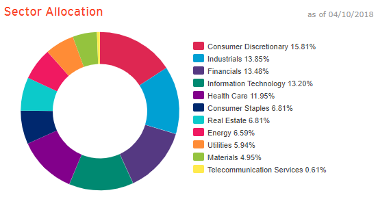
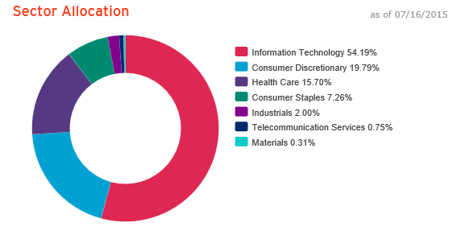
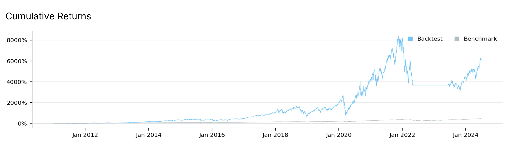
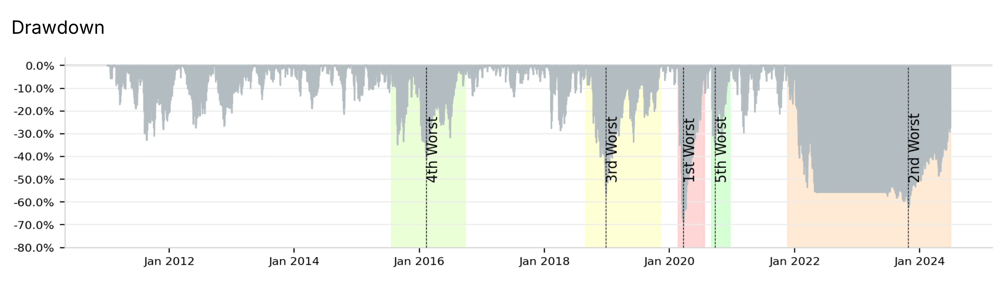
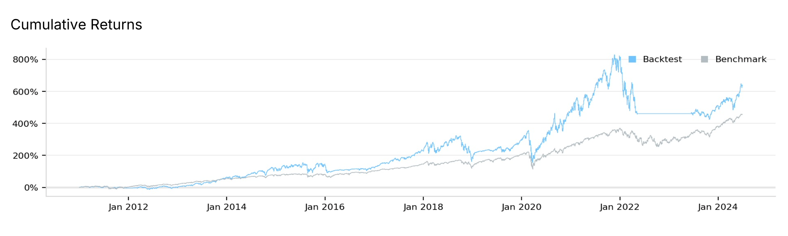
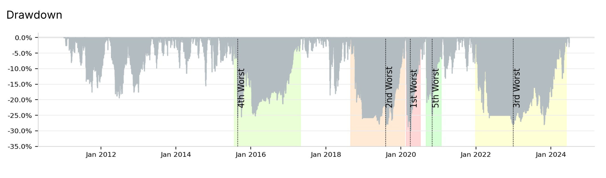

# Combined SPY and TQQQ Algorithm
<a href="https://www.quantconnect.com/terminal/processCache?request=embedded_backtest_041c2eb67fabd7b6208cdf4e38f3e57d.html">Open in QuantConnect</a>
## Overview

This capstone project involves the development and refinement of a QuantConnect trading algorithm that combines a dynamic strategy for SPY with a risk-managed approach for TQQQ. The goal is to optimize the balance between capturing market gains and managing drawdowns, particularly in volatile market conditions.

### SPY Overview
SPY, or the SPDR S&P 500 ETF Trust, is an exchange-traded fund (ETF) that tracks the performance of the S&P 500 Index, which is one of the most widely followed equity benchmarks in the United States. The S&P 500 Index comprises 500 of the largest publicly traded companies in the U.S., representing various sectors of the economy. SPY is often used as a proxy for the overall performance of the U.S. stock market.

**Assets Under Management (AUM)**: Approximately $400 billion.

**Average Volatility**: ~15% to 20% annually.

**Sector Exposure**: SPY offers broader sector exposure, including significant allocations to sectors like healthcare, industrials, and financials. 

### TQQQ Overview
TQQQ, or the ProShares UltraPro QQQ, is a leveraged ETF that aims to deliver three times the daily performance of the NASDAQ-100 Index. The NASDAQ-100 Index is composed of 100 of the largest non-financial companies listed on the NASDAQ stock exchange, with a strong emphasis on technology stocks. TQQQ uses derivatives and debt to amplify the returns of the NASDAQ-100, making it a highly volatile investment suitable for short-term trading rather than long-term holding.

**Assets Under Management (AUM)**: Approximately $23 billion.

**Average Volatility**: ~50% to 70% annually.

**Sector Exposure**: TQQQ is heavily weighted towards technology, with much higher exposure to tech companies than SPY, making it more sensitive to the performance of the tech sector.

### Similarities:
Both SPY and TQQQ include major U.S. technology companies as their top holdings. Companies like Apple (AAPL), Microsoft (MSFT), Amazon (AMZN), and NVIDIA (NVDA) are top constituents in both funds, reflecting the dominance of these companies in both the S&P 500 and NASDAQ-100 indices. This overlap occurs because these companies are some of the largest by market capitalization in the U.S., giving them significant weight in broad market indices.

## Project History

### 1. **Initial Machine Learning Approach**

I initially set out to create a machine learning model to predict significant bear markets. The model was intended to be trained on quarterly price data and macroeconomic factors such as GDP and unemployment rates.
   
This approach encountered significant challenges due to insufficient data and complexities in training the model within QuantConnect. The lack of enough data led to runtime errors and an inability to effectively train and test the model.
   
Due to these challenges, I decided to transition from a machine learning-based approach to a more straightforward rule-based algorithm.

### 2. **Transition to Rule-Based Algorithms**

#### **SPY Dynamic Threshold Strategy**
I developed a dynamic threshold algorithm for SPY that uses moving average crossovers to generate buy and sell signals. The thresholds for these signals are adjusted dynamically based on the market’s volatility (ATR) and momentum (RSI). After significant drawdowns, the strategy becomes more conservative in reentering the market, using increased thresholds for both buy and sell signals.
   
- **Buy Signal:** Triggered when the short-term moving average crosses above the long-term moving average, with the threshold adjusted by ATR and RSI.
   
- **Sell Signal:** Triggered when the short-term moving average crosses below the long-term moving average, again with the threshold adjusted by ATR and RSI.

#### **TQQQ Modified Buy-And-Hold Strategy**
**Initial Simple Percentage-Based Signals:**
   - **Buy Signal:** Reentry into TQQQ was triggered if the price increased by a certain percentage (e.g., 5%) after a stop-loss event.
   - **Sell Signal:** A predefined drawdown threshold (e.g., 30%) from the peak price triggered an exit from TQQQ.

**Refinement to Moving Average Crossover Signals:**
   - **Buy Signal:** I shifted to a more cautious approach where TQQQ is bought when a faster moving average (100 days) crosses above a slower moving average (300 days). This signal is designed to align with long-term uptrends.
   - **Sell Signal:** I maintained the drawdown-based exit strategy, ensuring protection against large losses in TQQQ.
   - The TQQQ portion of the strategy is primarily intended as a buy-and-hold strategy, with exits only during significant drawdowns to manage risk.

### 3. **Parameter Optimization**

#### **Key Parameters Identified for Optimization:**
- **`allocation_spy`:** The percentage of the budget reserved for investment in SPY. The remaining percentage is allocated to TQQQ.
- **`tqqq_drawdown_threshold`:** The percentage drop from the peak price that triggers an exit from TQQQ. This parameter was crucial for managing the high volatility of TQQQ.

### 4. **Performance Results**

The flexibility provided by this algorithm allows users to adjust key parameters to tailor the strategy to their specific risk tolerance and investment objectives. These parameters significantly impact the balance between risk and return, as demonstrated by the backtest results above at each end of the spectrum.

**Aggressive Parameters:** `allocation_spy` = 30%, `tqqq_drawdown_threshold` = 45%
- **Alpha:** 0.117
- **Maximum Drawdown:** 68.6%
- **Market Entries:** The algorithm entered the market 5 times, three times in SPY and twice in TQQQ.
- **Total Fees:** $1,195 in total fees.
- **Total Return:** 6,084%
- **Compound Annual Growth Rate (CAGR):** 35.7%
- **Net Gains:** The strategy netted $6.18 million on a $100,000 initial investment.
- **Timeframe:** January 1 2011 to June 30 2024.

 

**Conservative Parameters:** `allocation_spy` = 70%, `tqqq_drawdown_threshold` = 30%
- **Alpha:** 0.005
- **Maximum Drawdown:** 44.2%
- **Market Entries:** The algorithm entered the market 7 times, twice in SPY and 5 times in TQQQ.
- **Total Fees:** $779 in total fees.
- **Total Return:** 634%
- **Compound Annual Growth Rate (CAGR):** 15.9%
- **Net Gains:** The strategy netted $734,000 on a $100,000 initial investment.
- **Timeframe:** January 1 2011 to June 30 2024.

### User Considerations:

**Risk Tolerance**: 
  - **Aggressive Strategy**: Users with a higher risk tolerance might prefer a lower allocation to SPY (e.g., 30%) and a higher drawdown threshold for TQQQ (e.g., 45%). This setup significantly increases potential returns but comes with higher volatility and a larger maximum drawdown.
  - **Conservative Strategy**: Users seeking more stability might opt for a higher allocation to SPY (e.g., 70%) and a lower drawdown threshold for TQQQ (e.g., 30%). This approach reduces drawdowns and volatility but also lowers overall returns.

**Return Expectations**:
  - The aggressive strategy offers a much higher CAGR and total return, making it suitable for users aiming for substantial growth over a long-term horizon, despite the increased risk of significant drawdowns.
  - The conservative strategy provides more modest returns but with greater protection against large losses, making it better suited for users prioritizing capital preservation.

## Comparison to TQQQ Simple Buy-And-Hold Strategy

