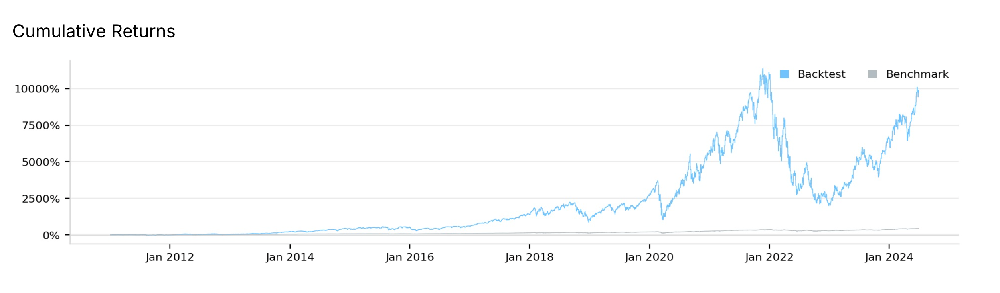
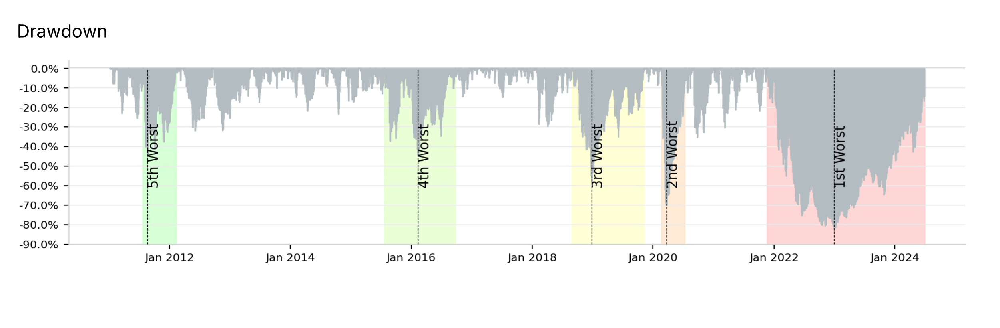

# Combined SPY and TQQQ Algorithm
<a href="https://www.quantconnect.com/terminal/processCache/?request=embedded_backtest_27b1ae29ab90b0afd04afbbdc6f4bf58.html">Open in QuantConnect</a>
## Overview

This project involves the development and refinement of a QuantConnect trading algorithm that combines a dynamic strategy for SPY with a risk-managed approach for TQQQ. The goal is to optimize the balance between capturing market gains and managing drawdowns, particularly in volatile market conditions.

## Project History

### 1. **Initial Machine Learning Approach**
   - **Objective:** I initially set out to create a machine learning model to predict significant bear markets. The model was intended to be trained on quarterly price data and macroeconomic factors such as GDP and unemployment rates.
   - **Challenges:** This approach encountered significant challenges due to insufficient data and complexities in training the model within QuantConnect. The lack of enough data led to runtime errors and an inability to effectively train and test the model.
   - **Outcome:** Due to these challenges, I decided to transition from a machine learning-based approach to a more straightforward rule-based algorithm.

### 2. **Transition to Rule-Based Algorithms**

#### **SPY Dynamic Threshold Strategy (50% Allocation)**
   - **Strategy:** I developed a dynamic threshold algorithm for SPY that used short-term (1 month) and long-term (3 months) moving averages to generate buy and sell signals. The thresholds for these signals were adjusted dynamically based on the market’s volatility (ATR) and momentum (RSI).
   - **Buy Signal:** Triggered when the short-term moving average crossed above the long-term moving average, with the threshold adjusted by ATR and RSI.
   - **Sell Signal:** Triggered when the short-term moving average crossed below the long-term moving average, again with the threshold adjusted by ATR and RSI.
   - **Capital Preservation:** After significant drawdowns, the strategy became more conservative in reentering the market, using increased thresholds for both buy and sell signals.

#### **TQQQ Modified Buy-And-Hold Strategy (50% Allocation)**
   - **Initial Simple Percentage-Based Signals:**
     - **Buy Signal:** Reentry into TQQQ was triggered if the price increased by a certain percentage (e.g., 5%) after a stop-loss event.
     - **Sell Signal:** A predefined drawdown threshold (e.g., 30%) from the peak price triggered an exit from TQQQ.
   - **Refinement to Moving Average Crossover Signals:**
     - **Buy Signal:** I shifted to a more cautious approach where TQQQ was bought when a faster moving average (100 days) crossed above a slower moving average (300 days). This signal was designed to align with long-term uptrends.
     - **Sell Signal:** I maintained the drawdown-based exit strategy, ensuring protection against large losses in TQQQ.
   - **Buy and Hold Strategy:** The TQQQ portion of the strategy is primarily intended as a buy-and-hold strategy, with exits only during significant drawdowns to manage risk.

### 3. **Parameter Optimization**

#### **Key Parameters Identified for Optimization:**
   - **`tqqq_drawdown_threshold`:** The percentage drop from the peak price that triggers an exit from TQQQ. This parameter was crucial for managing the high volatility of TQQQ.
   - **`spy_long_ma_period`:** The period (in months) for the long moving average used in the SPY strategy. This period defines the trend-following behavior of the strategy.
   - **`spy_capital_preservation_mult`:** The multiplier used to adjust the buy threshold during capital preservation mode. This helps in making more conservative reentries after a drawdown.

#### **Best Parameters Found:**
   - **`tqqq_drawdown_threshold`:** 0.45
   - **`spy_long_ma_period`:** 6 months
   - **`spy_capital_preservation_mult`:** 3.0

### 4. **Performance Results**

- **Alpha:** 0.082
- **Maximum Drawdown:** 57.4%
- **Market Entries:** The algorithm entered the market 9 times.
- **Total Fees:** $2,211 in total fees.
- **Total Return:** 3,364%
- **Compound Annual Growth Rate (CAGR):** 30%
- **Net Gains:** The strategy netted $3.3 million on a $100,000 initial investment.
- **Timeframe:** These results were achieved between January 1, 2011, and June 30, 2024.

### 5. **Key Decisions on Optimization Metrics**
   - **Metric Optimized:** I optimized the strategy for the Sharpe Ratio, which balances risk and return by adjusting for volatility. This choice ensures that the strategy achieves strong returns while managing risk effectively.

## Conclusion

Throughout this project, I iteratively refined the trading algorithm by testing various buy and sell signals, adjusting parameters, and focusing on key optimization metrics. The final algorithm combines a dynamic strategy for SPY with a cautiously managed TQQQ approach, making it well-suited for capturing market gains while managing the inherent risks, especially during volatile market conditions.

The best parameters found allowed the algorithm to achieve a strong balance between growth and risk management, with impressive overall returns. The TQQQ component of the strategy is primarily designed as a buy-and-hold strategy, exiting only during significant drawdowns to protect against large losses. This approach, optimized for the Sharpe Ratio, resulted in substantial gains over the backtested period, demonstrating the effectiveness of the combined strategy.

## Combined Strategy Returns

## Combined Strategy Drawdowns

## TQQQ Buy-And-Hold Strategy Returns

## TQQQ Buy-And-Hold Strategy Drawdowns
