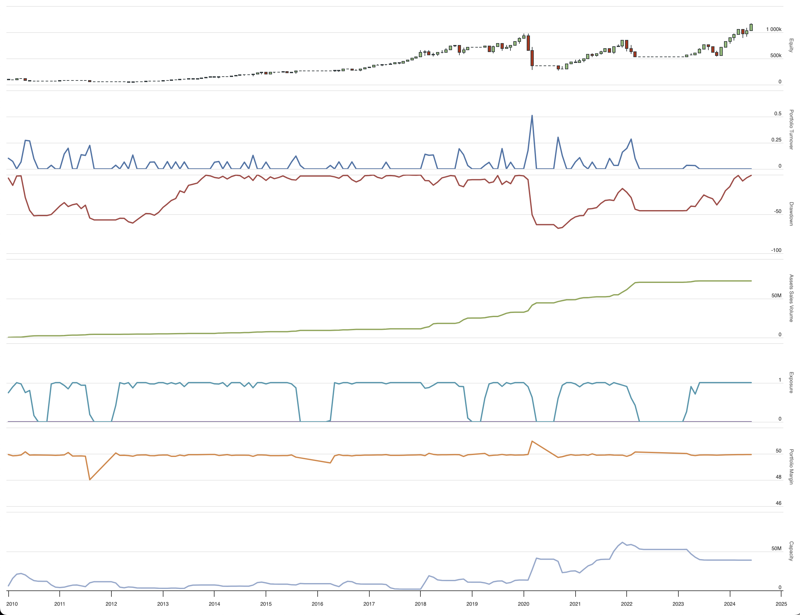
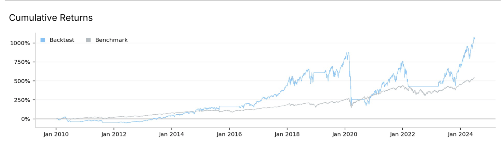

# SPXL Trading Algorithm
<h4>Blake Rayvid - <a href=https://github.com/brayvid>https://github.com/brayvid</a></h4>
<a href="https://www.quantconnect.com/terminal/processCache?request=embedded_backtest_7ed6443eaa33bc5645d3673d069a54bc.html" rel="Open in QuantConnect">Open in QuantConnect</a>

## Overview

This project represents the development and iterative refinement of a trading algorithm aimed at maximizing returns while effectively managing risk. The primary focus is on trading leveraged ETFs, specifically SPXL, using a combination of machine learning models, technical indicators, and dynamic risk management strategies. After extensive backtesting over the period from 2010 to 2024, the algorithm was able to achieve a Compound Annual Growth Rate (CAGR) of 19%, turning an initial investment of $100,000 into over $1 million.

## Development Process

### Initial Strategy

The project began with a trading algorithm designed to predict daily market movements using the S&P 500 ETF (SPY). The initial strategy employed a GradientBoostingClassifier, utilizing a variety of features including price ratios, trends, and technical indicators such as short-term and long-term Simple Moving Averages (SMA). The algorithm aimed to predict whether SPY would move up or down and to execute trades accordingly. However, this initial approach struggled to consistently outperform the market benchmark.

### Refinements and Enhancements

1. **Feature Engineering and Model Selection:**
   - Various machine learning models were tested, including enhanced feature engineering techniques, to increase predictive power.
   - Despite extensive efforts, many models underperformed during volatile market conditions or in comparison to a simple buy-and-hold strategy.

2. **Leveraged ETFs and Risk Management:**
   - The focus shifted from SPY to the leveraged ETF SPXL, which offers higher potential returns but also increases exposure to risk.
   - To address the increased volatility, a multi-layered stop-loss system was introduced. This included primary, secondary, and tertiary stop-loss thresholds to minimize drawdowns during sharp market declines.

3. **Dynamic Position Sizing:**
   - The algorithm incorporated dynamic position sizing based on market volatility, measured by the VIX index. This allowed the algorithm to scale back exposure during turbulent periods and increase exposure when the market was stable.

4. **Adaptive Trading Frequency:**
   - The strategy was further refined by incorporating an adaptive trading frequency that switched between daily and weekly trading based on market conditions. This helped to balance responsiveness to market changes with the need to avoid overtrading, particularly during periods of heightened volatility.

### Final Results

After backtesting several strategies over the period from January 2010 to June 2024 using the QuantConnect platform, the SPXL strategy demonstrated robust performance with a CAGR of 18% and an alpha of +0.028. The strategy successfully grew an initial $100,000 investment into $1.15 million, highlighting its effectiveness in navigating various market conditions while maintaining a strong focus on risk management. The algorithm’s ability to dynamically adjust its exposure and protect against large drawdowns was key to its success.

